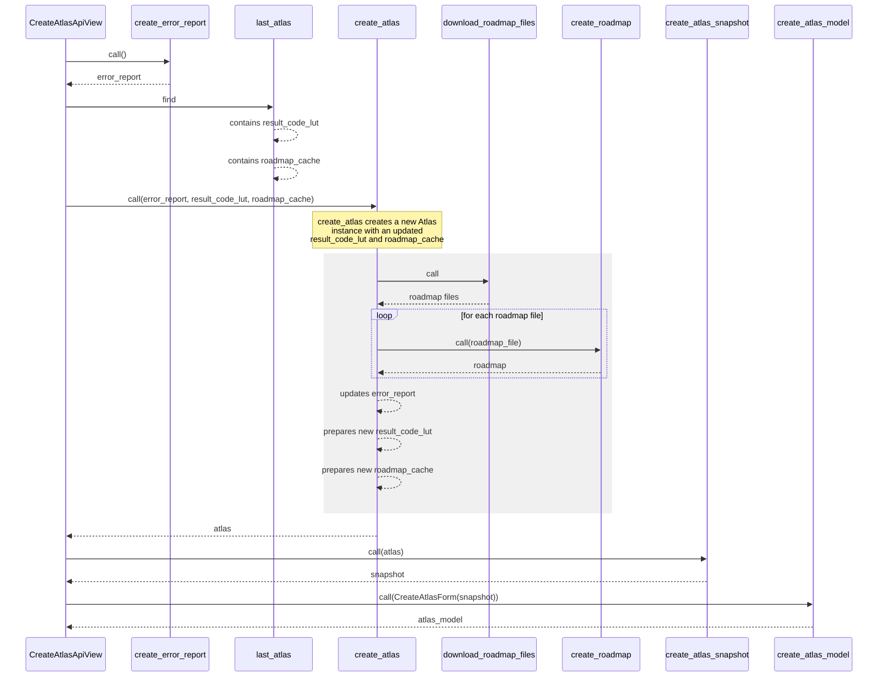
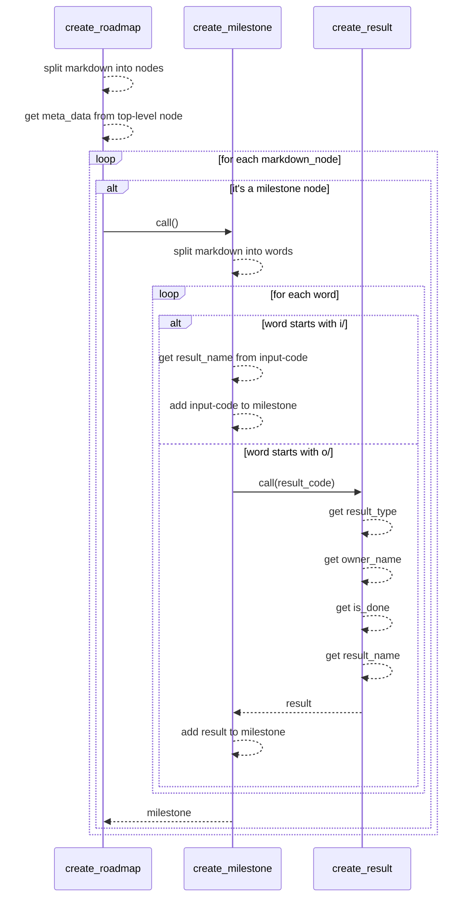

# CreateAtlasApiView creates an Atlas

## The CreateAtlasApiView workflow

```mermaid
sequenceDiagram
    participant CreateAtlasApiView
    participant create_error_report
    participant last_atlas
    participant create_atlas
    participant download_roadmap_files
    participant create_roadmap
    participant create_atlas_snapshot
    participant create_atlas_model

    CreateAtlasApiView->>create_error_report: call()
    create_error_report-->>CreateAtlasApiView: error_report

    CreateAtlasApiView->>last_atlas: find

    last_atlas-->>last_atlas: contains result_code_lut
    last_atlas-->>last_atlas: contains roadmap_cache

    CreateAtlasApiView->>create_atlas: call(error_report, result_code_lut, roadmap_cache)
    Note over create_atlas: create_atlas creates a new Atlas<br/>instance with an updated<br/>result_code_lut and roadmap_cache

    rect rgb(240, 240, 240)
        create_atlas->>download_roadmap_files: call
        download_roadmap_files-->>create_atlas: roadmap files

        loop for each roadmap file
            create_atlas->>create_roadmap: call(roadmap_file)
            create_roadmap-->>create_atlas: roadmap
        end

        create_atlas-->>create_atlas: updates error_report
        create_atlas-->>create_atlas: prepares new result_code_lut
        create_atlas-->>create_atlas: prepares new roadmap_cache
    end

    create_atlas-->>CreateAtlasApiView: atlas

    CreateAtlasApiView->>create_atlas_snapshot: call(atlas)
    create_atlas_snapshot-->>CreateAtlasApiView: snapshot

    CreateAtlasApiView->>create_atlas_model: call(CreateAtlasForm(snapshot))
    create_atlas_model-->>CreateAtlasApiView: atlas_model
```

## The create_roadmap workflow

```mermaid
sequenceDiagram
    participant create_roadmap
    participant create_milestone

    create_roadmap-->>create_roadmap: split markdown into nodes
    create_roadmap-->>create_roadmap: get meta_data from top-level node

    loop for each markdown_node
        alt it's a milestone node
            create_roadmap->>create_milestone: call()
            create_milestone-->>create_milestone: split markdown into words

            loop for each word
                alt word starts with i/
                    create_milestone-->>create_milestone: get result_name from input-code
                    create_milestone-->>create_milestone: add input-code to milestone
                else word starts with o/
                    create_milestone->>create_result: call(result_code)
                    create_result-->>create_result: get result_type
                    create_result-->>create_result: get owner_name
                    create_result-->>create_result: get is_done
                    create_result-->>create_result: get result_name
                    create_result-->>create_milestone: result
                    create_milestone-->>create_milestone: add result to milestone
                end
            end

            create_milestone-->>create_roadmap: milestone
        end
    end
```
