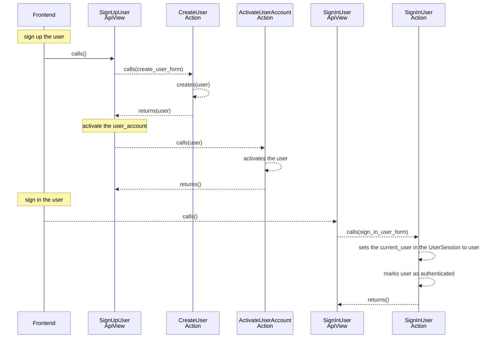

# Scenario: backend/mrd1_a_user_signs_up

## A user signs up

```mermaid
sequenceDiagram
    participant Frontend as Frontend
    participant SignUpUserApiView as SignUpUser<br/>ApiView
    participant CreateUserAction as CreateUser<br/>Action
    participant ActivateUserAccountAction as ActivateUserAccount<br/>Action
    participant SignInUserApiView as SignInUser<br/>ApiView
    participant SignInUserAction as SignInUser<br/>Action

    # 🔳 Sign up
    note over Frontend: sign up the user
    Frontend ->> SignUpUserApiView: calls()
    SignUpUserApiView -->> CreateUserAction: calls(create_user_form)
    CreateUserAction -->> CreateUserAction: creates(user)
    CreateUserAction -->> SignUpUserApiView: returns(user)

    # 🔳 Activate user
    note over SignUpUserApiView: activate the user_account
    SignUpUserApiView -->> ActivateUserAccountAction: calls(user)
    ActivateUserAccountAction -->> ActivateUserAccountAction: activates the user
    ActivateUserAccountAction -->> SignUpUserApiView: returns()

    # 🔳 Sign in
    note over Frontend: sign in the user
    Frontend -->> SignInUserApiView: calls()
    SignInUserApiView -->> SignInUserAction: calls(sign_in_user_form)
    SignInUserAction -->> SignInUserAction: sets the current_user in the UserSession to user
    SignInUserAction -->> SignInUserAction: marks user as authenticated
    SignInUserAction -->> SignInUserApiView: returns()
```

